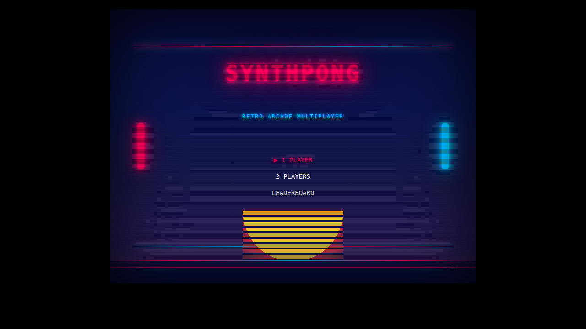
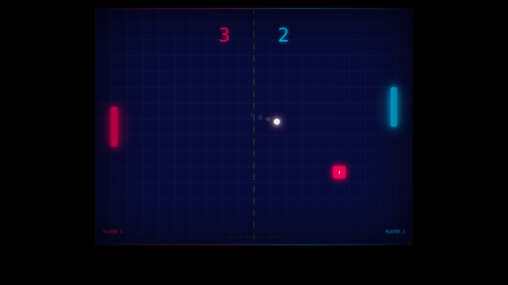
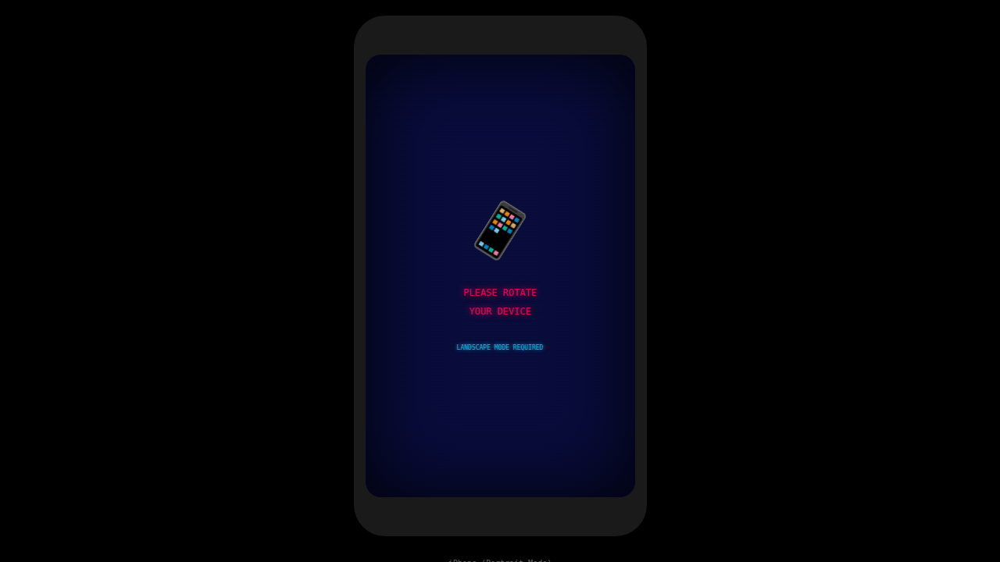

# SynthPong Game Mockups

These mockups demonstrate the visual design of the SynthPong game, based on the Synthwave/80s Retro Futurism aesthetic defined in the project documentation.

## Visual Design Specifications

The mockups follow the design guidelines from:
- `AI_REPO_GUIDE.md` - Core visual conventions
- `.github/prompts/pong/rules/domain-ui.prompt.md` - Detailed UI specifications
- `docs/AI Agent Prompt for Retro Pong Game.md` - Technical specifications

### Color Palette

| Element | Hex Code | Description |
|---------|----------|-------------|
| Background | `#090D40` | Deep Void Blue |
| Grid Lines | `#2b2b2b` | Perspective scroll effect |
| Player 1 | `#FF005C` | Neon Pink with bloom |
| Player 2 | `#00C4FF` | Cyber Cyan with bloom |
| Ball | `#FFFFFF` | White core |

### Typography
- **Font**: "Press Start 2P" (Google Fonts)
- **Style**: Retro arcade pixelated

### Effects
- CRT scanline overlay
- Vignette effect
- Neon glow/bloom on paddles
- Particle trails on ball

## Screenshots

### Menu Screen


The main menu features:
- Glowing "SYNTHPONG" title in neon pink
- Subtitle in cyber cyan
- Menu options with selection indicator
- Decorative paddles showing player colors
- Gradient neon border lines
- CRT scanline and vignette effects

### Gameplay Screen


The gameplay view shows:
- Score display in player colors (pink/cyan)
- Neon paddles with bloom effects
- White ball with motion trail
- Dashed center line
- Power-up indicator (enlarge power-up shown)
- Grid background for depth
- Player labels at bottom

### Mobile Portrait View


When device is in portrait orientation:
- "Please Rotate" message displayed
- Animated phone icon
- Landscape mode enforcement
- Maintains Synthwave aesthetic

## HTML Mockup Files

The mockups are implemented as static HTML/CSS files that can be viewed in any browser:

- `menu-screen.html` - Main menu mockup
- `gameplay-screen.html` - Active gameplay mockup
- `mobile-portrait.html` - Mobile rotation prompt mockup

### Viewing the Mockups

```bash
# Start a local server in the mockups directory
cd mockups
python3 -m http.server 8080

# Open in browser
# http://localhost:8080/menu-screen.html
# http://localhost:8080/gameplay-screen.html
# http://localhost:8080/mobile-portrait.html
```

## Implementation Notes

These mockups are purely visual representations created with HTML/CSS. The actual game will be implemented using:

- **Phaser 3** for game rendering and physics
- **WebGL** with PostFX pipeline for bloom effects
- **Colyseus** for multiplayer networking

The CSS effects shown (bloom via `box-shadow`, CRT via `linear-gradient`) demonstrate the intended look. In the Phaser implementation, native PostFX effects will provide higher quality rendering.
